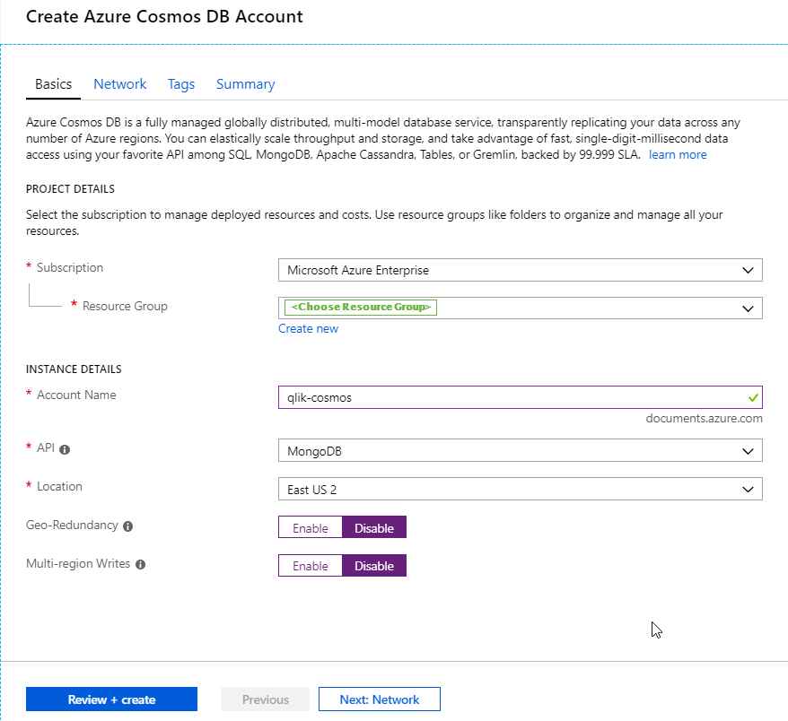
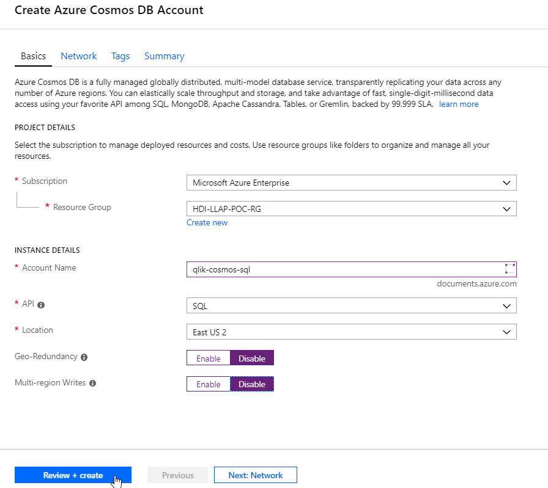

Cosmos DB Overview
==================

Cosmos DB is a fast growing, multi-modal database service in Microsoft
Azure offering several API's. Currently, the SQL API is the most popular
and widely used API. When you create a Cosmos DB account, you must
decide which API you want to use as the data will get stored in
corresponding data model/format.

Key Cosmos DB capabilities
==========================

-   Turnkey global distribution

    -   You can [distribute your
        > data](https://docs.microsoft.com/en-us/azure/cosmos-db/distribute-data-globally) to
        > any number of [Azure
        > regions](https://azure.microsoft.com/regions/), with
        > the [click of a
        > button](https://docs.microsoft.com/en-us/azure/cosmos-db/tutorial-global-distribution-sql-api).
        > This enables you to put your data where your users are,
        > ensuring the lowest possible latency to your customers.

    -   Using Azure Cosmos DB\'s multi-homing APIs, the app always knows
        > where the nearest region is and sends requests to the nearest
        > data center. All of this is possible with no config changes.
        > You set your write-region and as many read-regions as you
        > want, and the rest is handled for you.

    -   As you add and remove regions to your Azure Cosmos DB database,
        > your application does not need to be redeployed and continues
        > to be highly available thanks to the multi-homing API
        > capability.

-   Multiple data models and popular APIs for accessing and querying
    > data

    -   The underlying atom-record-sequence (ARS) data model that Azure
        > Cosmos DB is built on natively supports multiple data models,
        > including document, graph, key-value, table, and column-family
        > data models.

    -   APIs for the following data models are supported with SDKs
        > available in multiple languages:

        -   [SQL
            > API](https://docs.microsoft.com/en-us/azure/cosmos-db/sql-api-introduction):
            > A schema-less JSON database engine with rich SQL querying
            > capabilities

        -   [MongoDB
            > API](https://docs.microsoft.com/en-us/azure/cosmos-db/mongodb-introduction):
            > A massively scalable *MongoDB-as-a-Service* powered by
            > Azure Cosmos DB platform. Compatible with existing MongoDB
            > libraries, drivers, tools, and applications

        -   [Cassandra
            > API](https://docs.microsoft.com/en-us/azure/cosmos-db/cassandra-introduction):
            > A globally distributed Cassandra-as-a-Service powered by
            > Azure Cosmos DB platform. Compatible with existing [Apache
            > Cassandra](https://cassandra.apache.org/) libraries,
            > drivers, tools, and applications

        -   [Gremlin
            > API](https://docs.microsoft.com/en-us/azure/cosmos-db/graph-introduction):
            > A fully managed, horizontally scalable graph database
            > service that makes it easy to build and run applications
            > that work with highly connected datasets supporting Open
            > Gremlin APIs (based on the [Apache TinkerPop
            > specification](http://tinkerpop.apache.org/), Apache
            > Gremlin)

        -   [Table
            > API](https://docs.microsoft.com/en-us/azure/cosmos-db/table-introduction):
            > A key-value database service built to provide premium
            > capabilities (for example, automatic indexing, guaranteed
            > low latency, global distribution) to existing Azure Table
            > storage applications without making any app changes.

The SQL API can be interacted with using ODBC, REST, or native code
bases such as .NET (Core and Standard), Java, Go, Node.js, or Python.

There are many connectivity methods validated with Qlik Partner
Engineering:

a)  SQL API using ODBC Connector in Qlik Sense

b)  MongoDB API using the Qlik Sense MongoDB Connector (in Beta as of
    Oct 2018)

c)  MongoDB SQL API using REST Connector in Qlik Sense

d)  Mongo DB API using the gRPC connector for Qlik Core

The focus of this document is the details of connecting to the SQL API
via the ODBC Connector.

About Qlik Sense
================

Qlik Sense gives you data superpowers. Easily combine all your data
sources, no matter how large, into a single view. Qlik's Associative
engine indexes every possible relationship in your data so you can gain
immediate insights and explore in any direction your intuition takes
you. Unlike query-based tools, there's no pre-aggregated data and
predefined queries to hold you back. That means you can ask new
questions and create analytics without having to build new queries or
wait for the experts.

{width="6.5in" height="2.4298611111111112in"}

**Interactive analysis, without boundaries**

Ask any question and quickly explore across all your data for insight,
using global search and interactive selections. All analytics update
instantly with each click, no matter how deep you go, furthering
analysis or pivoting your thinking in new directions. There's is no
limit to exploration and no data left behind.

**Simply smarter visualizations**

Innovative visualizations put your data in the right context to answer
any question. Explore the shape of data and pinpoint outliers. Use
advanced analytics integration and geographic calculation to broaden
insight. And it\'s fully interactive - easily pan, zoom, and make
selections to find insights visually.

**Create and explore on any device**

Explore, create, and collaborate on any device, directly at the point of
decision. Qlik Sense is built from the ground up with responsive mobile
design and touch interaction. Build analytics apps once, and they'll
work everywhere, on desktop, tablet, or mobile devices.

To learn more, go to <https://www.qlik.com/us/products/qlik-sense>

Cosmos DB Setup
===============

Setting up a new Cosmos DB account is straightforward, once you pick
your path. For this validation exercise, we are testing the SQL API
(formerly DocumentDB) as our query engine for Qlik.

### Step 1. Sign into the Azure Portal -- Navigate to Cosmos DB

### Step 2. Add a new Cosmos DB instance

### Step 3. Complete Project Details

For this use case, we are selecting the SQL API.

### Step 4. Validate and Create! 

The process will run for a few minutes and we have our database!

Conversation - What is an RU?
-----------------------------

Cosmos DB is priced and scaled using a model called a "Request Unit" or
RU. The RU defines how much throughput (and corresponding hardware
resources needed to provide it) you can use with the Cosmos DB instance.
There are two modes, **Fixed** or **Unlimited** which govern the
capacity of the document collection during use. You can learn more about
how it works
[here](https://docs.microsoft.com/en-us/azure/cosmos-db/request-units).
This setting will govern the insert, update and query capacity (per
second) of the Cosmos DB collection, so consideration must be given to
expected workloads during the setup process as certain element cannot be
changed after creation.

Step 5. Create Database and Collection
--------------------------------------

Before we can load data, we need to create
the repository inside Cosmos DB that we'll need to write data into. We
start by opening [Data Explorer]{.underline} in the menu.

We need to create a New Database and a New Collection underneath that
database. Here is where you will set your RU capacity. For this small
data set and test, we'll go with 1000 RU/s.

Step 6. Loading Data
--------------------

There are many ways to load data into Cosmos DB, the tool we are going
to use for validation is called the Azure Cosmos DB Data Migration tool.
The link to the utility can be found
[here](https://docs.microsoft.com/en-us/azure/cosmos-db/import-data).
The data set we will use as a test data set is video game sales
1982-2016 and can be found
[here](https://www.kaggle.com/gregorut/videogamesales).

Once we have downloaded both the utility and data, we are ready to
proceed.

#### Data Transfer UI 

Navigate to the unzipped folder and run DTUI.exe. This will spawn the
loader utility UI.

#### Source Information

Select CSV File from the drop-down in Source information setting...
Notice the utility supports a wide range of data source files and
connections as sources.

#### Target Information

We will need to collect some information from our Cosmos DB system to
populate the required fields.

[Connection String]{.underline}: This is the PRIMARY CONNECTION STRING
from the Read-Write Keys section of the Keys menu. NOTE: to get it to
work, you have to manually add: ;database=\<dbname\>

Our connection string looks like:
*AccountEndpoint=https://qlik-cosmos-sql.documents.azure.com:443/;AccountKey=Ay1cxkuONzTOZuRYjI83FIrd99NBaXOjOHb0LifsxeEW3D7jWZLA0uMgHvSt5SuWTJ2Ial00hGkVsO36FRbaUQ==;database=vg*

[Collection]{.underline}: This is the name of the collection we created
earlier.

Click next a few times, and "Import" to begin the data transfer. This
may take a few minutes...

We can look in our Data Explorer and find that indeed the data has
loaded!

We have now completed our Cosmos DB database setup.

Qlik Sense Configuration
========================

Step 1. Install & Configure Qlik Sense
--------------------------------------

This is not covered in this guide, as we pre-assume a running Qlik Sense
system. If you need to setup Qlik Sense -- please refer to this guide
([Install Qlik Sense on
Azure](https://azuremarketplace.microsoft.com/en-us/marketplace/apps/qlik.qlik-sense))
or download Qlik Sense Desktop ([Qlik Sense
Desktop](https://www.qlik.com/us/try-or-buy/download-qlik-sense)).

Step 2. Download, Install & Configure ODBC driver 
--------------------------------------------------

Download the ODBC driver from ([Download ODBC
Driver](https://docs.microsoft.com/en-us/azure/cosmos-db/odbc-driver)).
Follow the setup steps in the ODBC driver link to configure the
connection to Cosmos DB. Note: this is a simple data set that will not
require Schema Editing.

### ODBC Concerns

It is important to understand that the SQL API (formerly DocumentDB) is
not fully ANSI SQL-compliant because Cosmos DB is schema-less and is not
based on relational model, so some SQL syntax assuming relational
capabilities is not applicable. To that end, the SQL statements issued
through the ODBC driver are being translated into a Cosmos DB SQL
dialect which doesn't have equivalents for all constructs. To try and
prevent these translation issues, you might have to apply a "schema"
that maps the conversions and data types. The ODBC driver page gives you
suggestions and methods to help navigate this process. This mapping will
have to occur for every database/collection inside a Cosmos DB account.

Creating the Qlik Sense App 
============================

### Step 1. Open Qlik Sense and create a new app

### Step 2. Select - Add data from files and other sources

### Step 3. Select ODBC

### Step 4. Choose the ODBC connection we made earlier and name it

### Step 5. Choose the database and collection we need from that connection

### Step 6. Add data and generate Insights...

### Step 7. Explore!

By either using Insights or directly building on the canvas, we can
build our app exploring video games sales!

Summary & Conclusion
====================

This document shows how to use Qlik Sense with the Cosmos DB SQL API
account with a step-by-step tutorial. The ODBC connector is the easiest
driver to get going against a Cosmos DB dataset, but may require extra
modelling to correctly map a schema configuration.
